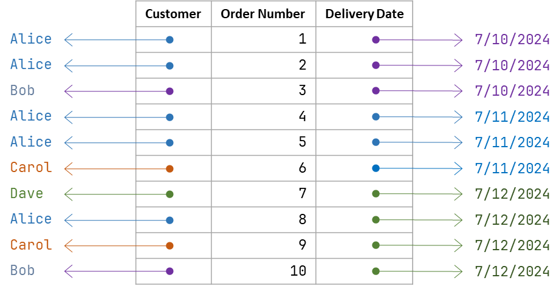
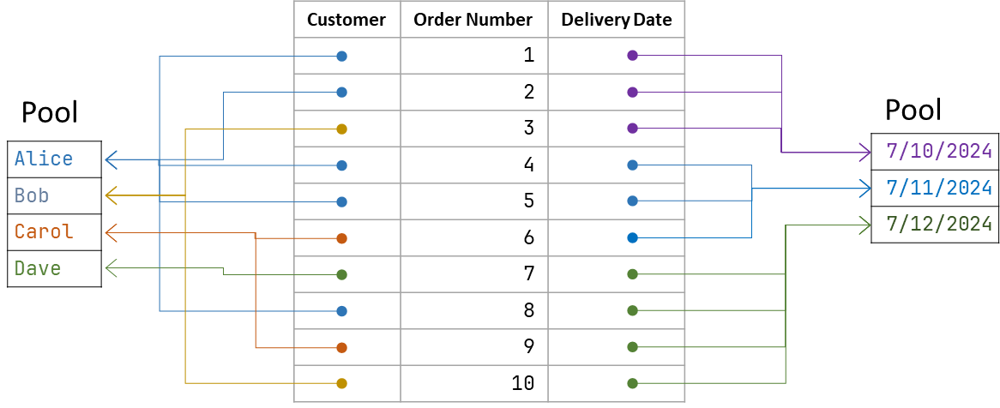

# Pooling

## Introduction

Data Frame instances support (optional) **pooling** of object values. Pooling means that as an object is added to the data frame, it is first looked up in the pool and if an equal object is found, that reference is used. If an equal object is not found, the new object is added to the pool. In other words, with pooling for objects that are equal the memory needs to be allocated for only one instance.

A pool is scoped for a column. 

For columns with a lot of repeating values pooling can result in substantial memory savings and, in certain scenarios, in performance improvements.

### Example 
Let's say there is a data frame storing customer orders. There are three columns: customer name (string), order number (integer), order date (date).

There are 10 rows in the data frame. 

Without pooling there are 10 instances of string objects and 10 instances of date objects.



With pooling, there are 4 instances of strings and 3 instances of dates.



## Managing Pooling

### Enabling and Disabling 

Pooling can be enabled and disabled at the data frame or at the individual column level.

To enabling pooling at the data frame level, call `enablePooling()` on a data frame instance, for example

```java
DataFrame df = new DataFrame("Data Frame");
// ...populate data frame...
df.enablePooling();
```

This method will enable pooling on all data frame columns (specifically, object columns, as there is no pooling of primitive values, so enabling pooling on primitive columns does nothing.)

To enable pooling for a specific column call `enablePooling()` on this column, for example
```java
DataFrame df = new DataFrame("Data Frame");
// ...populate data frame...
df.getColumnNamed("name").enablePooling();
```

To disable pooling call `disablePooling()` on either a data frame instance or a column instance, depending on the desired scope.  

### Data Frame Transformation and Pooling

By default, the data frames created as a result of extracting data from an existing data frame (using methods such as `select`, `reject`, `partition`) will retain the pooling setting of the source data frame.

Note that if the source data frame was created with pooling enabled, regardless of its current pooling status, the derived data frames will benefit from that. That is, the total number of value instances will not increase as no new instances will be created. So you only need pooling on derived data frames if you are planning to add data to them.

If the source data frame has pooling enabled, and you do not need pooling for a derived data frame as you are not planning to add any data to it, call `disablePooling` on it to avoid the overhead of having an active pool.
